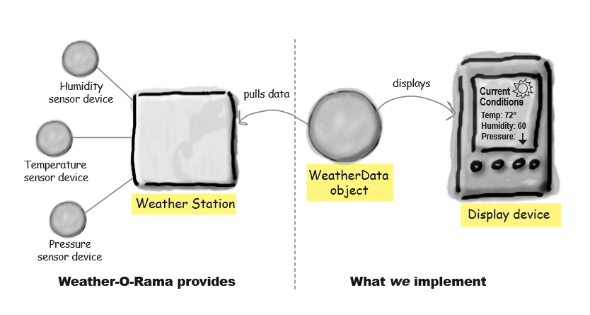

## Wheather Station

Goal: It is aimed to build a system that monitors the current weather conditions with temperature,humidity and pressure values. This system is based on the WeatherData object and displays 3 states as current conditions, sttistics and forecast. It is accepted that the current weather data is supplied to the system externally. This object is updated in real time when new measurements are taken. So, the data on our screen should change as the taken data changes. CurrentConditions state displays the current weather values as temperature, humidity, pressure. In statistics state, average,minimum and maximum temperature values are shown. Lastly, in forecast state, a small suggestion screen is shown.

Overview Schema: 

